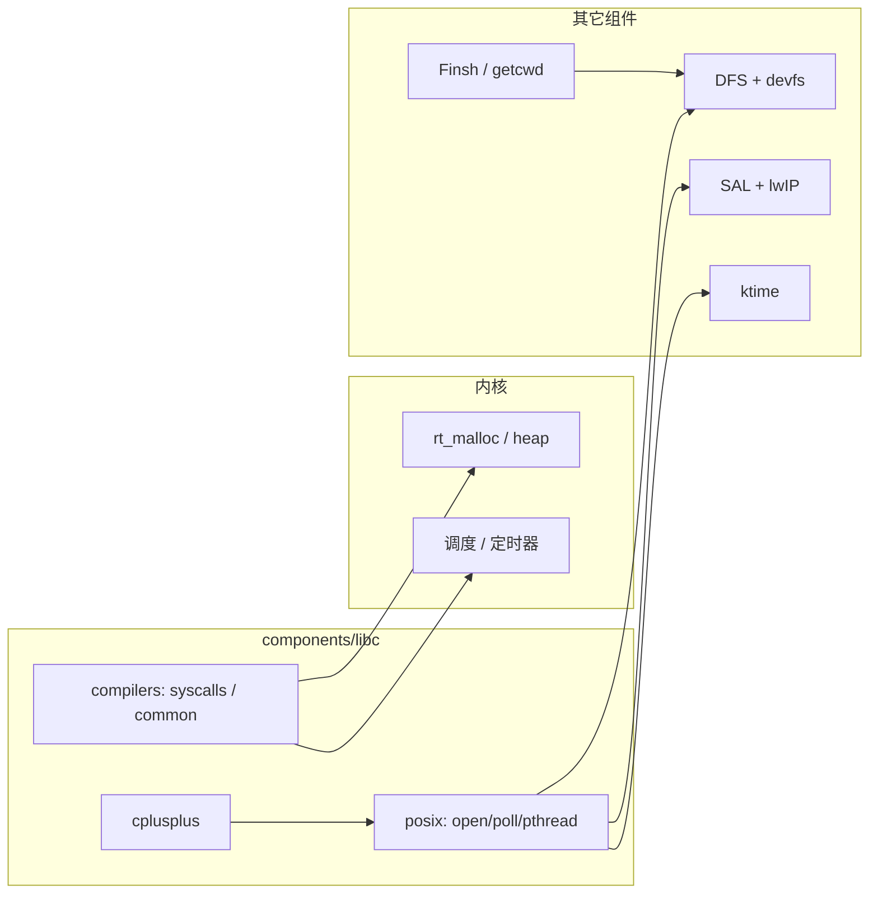

# RT-Thread 5.2.0 `components/libc` 模块详细分析

**`components/libc`** 在 RT-Thread 中承担三层职责：**（1）按工具链对接 C 库**（newlib / picolibc / ARMCC / IAR dlib / musl 等），把 **`malloc`/`write`/`sbrk`** 等落到内核 **`rt_malloc`/设备/console**；**（2）提供与内核协同的 ISO C 补充实现**（时区、部分宽字符/字符串包装等）；**（3）可选 POSIX / C++ 运行时**，与 **DFS、SAL、ktime、Finsh** 等组件通过 **`RT_USING_POSIX_*`** 宏组合启用。

根菜单在 **`components/libc/Kconfig`**：**「C/C++ and POSIX layer」**，下挂 **`compilers/common`**、**`posix`**、**`cplusplus`** 的 `rsource`。

---

## 1. 编译总入口与 Nano 关系

**`components/libc/SConscript`**：

```python
if not GetDepend('RT_USING_NANO'):
    for d in list:
        ... SConscript(subdir)
```

即：**开启 `RT_USING_NANO` 时，整个 `libc` 组件目录不参与编译**（极简内核不使用本层 POSIX/多工具链适配）。正常完整版工程关闭 Nano 后，会递归 **`compilers`**、**`posix`**、**`cplusplus`** 等子目录。

---

## 2. `compilers/` — C 库与工具链粘合

**`compilers/SConscript`** 对子目录（**`armlibc`、`common`、`dlib`、`musl`、`newlib`、`picolibc`** 等）逐个执行子 **`SConscript`**。各工具链子目录通过 **检测 `rtconfig` 中的 libc 版本或 `PLATFORM`** 决定是否 **`Return('group')` 空组** 或加入 **`DefineGroup('Compiler', ...)`**。

### 2.1 `compilers/common/` — 与工具链无关的公共层

- **`SConscript`**：**`Glob('*.c')`** 编入 **`Compiler`** 组，并递归 **`extension/`** 等子目录。  
- **源文件示例**：**`ctime.c`**（时区/DST，与 **`RT_LIBC_USING_LIGHT_TZ_DST`** 等配合）、**`cstring.c`、`cctype.c`、`cstdlib.c`、`cwchar.c`、`cunistd.c`** 等，对标准接口做 RT 环境下的补充或包装。  
- **`CPPPATH`**：**`compilers/common/include`**，内含 **`unistd.h`、`sys/errno.h`** 等与 DFS/POSIX 共用的声明路径（DFS v2 的 **`dfs.h`** 亦会 **`#include`** 本目录下的 **`dirent.h`** 等）。  
- **`Kconfig`（`compilers/common/Kconfig`）**：**「ISO-ANSI C layer」** 下 **时区与夏令时**（轻量默认时区小时/分/秒，或完整 TZ 数据库包）。

### 2.2 `compilers/newlib/` — GNU ARM GCC + Newlib

- **条件**：**`GetNewLibVersion(rtconfig)`** 非空且 **未** 定义 **`RT_USING_EXTERNAL_LIBC`**。  
- **`syscalls.c`**：实现 **Newlib 可重入桩**（**`_malloc_r` / `_free_r` / `_realloc_r` / `_calloc_r`** → **`rt_malloc`/`rt_free`/`…`**；无 heap 时 **`_sbrk_r`** 报错）；以及 **`_read`/`_write`/`_open`/`_close`** 等与 **控制台 / DFS POSIX** 的衔接、**`__errno`**、**`exit`/`abort`** 等。  
- **`CPPDEFINES`**：**`RT_USING_NEWLIBC`、`RT_USING_LIBC`、`_POSIX_C_SOURCE=1`**；**`LIBS = ['c','m']`**。

### 2.3 `compilers/picolibc/`

与 newlib 类似，通过 **`GetPicoLibcVersion`** 检测；**`__PICOLIBC_ERRNO_FUNCTION=pico_get_errno`** 等与 Pico 生态对齐；通常不额外 **`LIBS = ['c','m']`**（由链接脚本/工具链默认处理，以 **`SConscript`** 为准）。

### 2.4 `compilers/armlibc/`

**`armcc` / `armclang`**：**`RT_USING_ARMLIBC`、`RT_USING_LIBC`**，提供 ARM 编译器自带 libc 所需的 RT 侧桩与宏（如 **`__STDC_LIMIT_MACROS`**）。

### 2.5 `compilers/dlib/`

**`iccarm`（IAR）**：**`RT_USING_DLIBC`**；若 **`DFS_USING_POSIX`** 则增加 **`_DLIB_FILE_DESCRIPTOR`**，并按 IAR 版本决定是否 **`_DLIB_THREAD_SUPPORT`**。

### 2.6 `compilers/musl/`

检测到 **musl** 时定义 **`RT_USING_MUSLLIBC`**，**`LIBS = ['c','gcc']`**，**`LINKFLAGS`** 含 **`kernel.specs`**（裸机/内核型 musl 用法），用于部分 **RISC-V/Linux 风格或特定 BSP** 链。

### 2.7 `RT_USING_EXTERNAL_LIBC`

在 **`libc/Kconfig`** 中说明：供 **外部 C 库软件包**（非工具链内置 newlib/picolibc）选择；**`newlib`/`picolibc` 的 `SConscript`** 在检测到 **`RT_USING_EXTERNAL_LIBC`** 时会 **跳过** 自带桩，避免与包内实现重复。

---

## 3. `posix/` — POSIX 子集

**`posix/SConscript`** 递归 **`delay`、`ipc`、`pthreads`、`signal`、`tls`、`libdl`** 以及 **`io/`** 下各子目录（**`stdio`、`poll`、`epoll`、`mman`、`aio`、`termios`、`eventfd`、`signalfd`、`timerfd`** 等）。

**`posix/Kconfig`** 为总控，典型依赖链如下（节选）：

| 配置 | 作用 | 典型依赖 |
|------|------|----------|
| **`RT_USING_POSIX_FS`** | 文件系统 POSIX I/O | **`RT_USING_DFS`、`DFS_USING_POSIX`** |
| **`RT_USING_POSIX_DEVIO`** | 设备作 fd | **`RT_USING_DFS_DEVFS`** |
| **`RT_USING_POSIX_STDIO`** | stdin/stdout/stderr 语义 | **`RT_USING_POSIX_DEVIO`** |
| **`RT_USING_POSIX_POLL` / `SELECT` / `EPOLL`** | I/O 多路复用 | Smart 下 epoll/signalfd 等常默认 y |
| **`RT_USING_POSIX_SOCKET`** | BSD socket | **`RT_USING_SAL`、`RT_USING_POSIX_SELECT`** |
| **`RT_USING_POSIX_DELAY`** | `sleep`/`usleep` 等 | **`RT_USING_KTIME`** |
| **`RT_USING_POSIX_CLOCK`** | `clock_gettime` 等 | **`RT_USING_POSIX_DELAY`** |
| **`RT_USING_POSIX_TIMER`** | `timer_create` 等 | **`RT_USING_KTIME`、`RT_USING_RESOURCE_ID`** |
| **`RT_USING_PTHREADS`** | pthread | **`RT_USING_POSIX_CLOCK`** |
| **`RT_USING_MODULE`** | `dlopen`/`dlsym` | 动态模块 |

**`posix/ipc/Kconfig`**：**`RT_USING_POSIX_PIPE`**（pipe/FIFO）、**`RT_USING_POSIX_MESSAGE_QUEUE`**（**`mqueue.h`**，**`select RT_USING_DFS_MQUEUE`**）、**`RT_USING_POSIX_MESSAGE_SEMAPHORE`** 等。

各子目录 **`SConscript`** 使用 **`DefineGroup('POSIX', src, depend=['RT_USING_xxx'])`** 与具体宏绑定。

---

## 4. `cplusplus/` — C++ 支持

**`cplusplus/SConscript`**：

- 核心：**`cxx_crt_init.c`、`cxx_crt.cpp`** — 全局构造/析构、与 RT-Thread 启动顺序配合。  
- **`depend=['RT_USING_CPLUSPLUS']`**。  
- GCC 类工具链且 **未** 开 **`RT_USING_CPP_EXCEPTIONS`** 时加 **`-fno-exceptions -fno-rtti`** 及 **section gc**，减小体积。  
- 递归 **`cpp11/`**、**`os/`** 等子目录。

**`cplusplus/Kconfig`**：

- **`RT_USING_CPLUSPLUS11`**：**`select`** POSIX FS/stdio、pthreads、RTC 等，以支撑 **C++11 线程与 I/O**。  
- **`RT_USING_CPP_WRAPPER`**：C API 的 C++ 封装。  
- **`RT_USING_CPP_EXCEPTIONS`**：开启异常（体积与运行时开销增加）。

---

## 5. 与其它组件的衔接关系



- **DFS**：**`DFS_USING_POSIX`** 打开后，**`open`/`read`/`write`** 走 **`dfs_file`**；**`finsh`** 的 **`msh_file.c`**、**`msh_exec_script`** 依赖此路径。  
- **控制台**：**`RT_USING_CONSOLE` + `RT_USING_DEVICE`** 与 **`isatty`**（**`cunistd.c`**）及 newlib **`_write`** 向串口 **`rt_device_write`** 协同。  
- **网络**：**`RT_USING_POSIX_SOCKET`** 把 fd 层接到 **SAL**。  
- **errno**：多处在 **`rt_set_errno`/`_rt_errno`** 与 libc 桩之间同步。

---

## 6. 头文件布局（阅读源码时）

- **`compilers/common/include/`**：嵌入式常用 **POSIX 子集头文件**（与工具链头共同使用需注意 **include 顺序**）。  
- **`posix/`** 各子目录自有 **`*.h`** 与 **`SConscript`**。  
- **`compilers/common/extension/`**：**`fcntl`** 等扩展（含 **octal/msvc** 子目录）按平台拆分 **`SConscript`**。

---

## 7. 配置与移植注意点

1. **先选工具链再认 libc**：**`newlib`/`picolibc`/`armlibc`/`dlib`/`musl`** 由 **`rtconfig.PLATFORM`** 与版本检测决定，勿在工程中重复定义冲突的 **`_write_r`** 等。  
2. **Heap**：Newlib 桩默认 **`malloc` → `rt_malloc`**，需 **`RT_USING_HEAP`**，否则 **`_sbrk_r`** 路径会 **断言失败**（见 **`syscalls.c`**）。  
3. **POSIX 与 DFS**：只开 **`RT_USING_DFS`** 不等于 **`open` 可用**；需 **`DFS_USING_POSIX`** 及 **`RT_USING_POSIX_FS`** 等组合。  
4. **Nano**：极简裁剪时整库关闭，应用层只能用 **`rt_kprintf`** 等内核 API，无本目录 POSIX。  
5. **C++**：除 **`RT_USING_CPLUSPLUS`** 外，链接脚本需包含 **`.init_array`/`.ctors`** 等与 **`cxx_crt`** 一致的段（由 BSP/工具链模板保证）。

---

## 8. 相关文档

- 仓库内已有：**`components/libc/compilers/readme.md`**、**`posix/readme.md`**、**`cplusplus/README.md`** 及各 **`compilers/*/README.md`**。  
- DFS / Finsh：**`doc/RT-Thread-5.2.0-dfs-模块详细分析.md`**、**`doc/RT-Thread-5.2.0-finsh-模块详细分析.md`**。  
- 组件总览：**`doc/RT-Thread-5.2.0-components-模块详解.md`**。

---

*文档对应源码树：`rt-thread-5.2.0/components/libc`（5.2.0）。*
