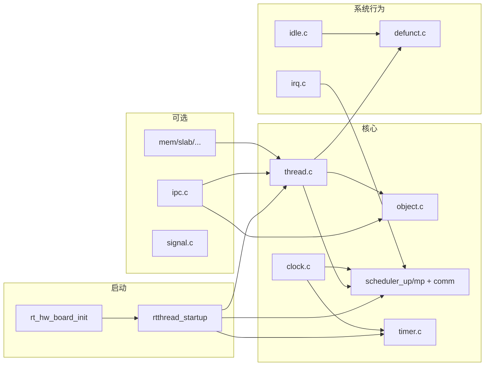

# RT-Thread 5.2.0 `src/` 目录模块逻辑分析

本文说明内核源码目录 `rt-thread-5.2.0/src` 内各模块的职责、相互调用关系，以及编译裁剪与单核/多核分支逻辑。

---

## 1. 文件总览与构建裁剪

根目录下参与内核编译的 C 文件由 `SConscript` 中的 `Glob('*.c')` 收集，再按 **Kconfig / rtconfig.h** 宏删除不需要的单元：

| 源文件 | 模块职责 | 不参与编译的条件 |
|--------|-----------|------------------|
| `object.c` | 内核对象容器、类型、查找、钩子 | 始终需要 |
| `thread.c` | 线程生命周期、栈、yield/delay、与调度器协作 | 始终需要 |
| `scheduler_up.c` / `scheduler_mp.c` | 就绪表、`rt_schedule`、调度器启停 | `RT_USING_SMP`：用 mp，否则用 up |
| `scheduler_comm.c` | UP/SMP 共用的调度上下文 API（线程 stat、定时器与调度绑定等） | 始终需要 |
| `cpu_up.c` / `cpu_mp.c` | 每 CPU 抽象、自旋锁等与 SMP 相关差异 | 同上，与 scheduler 成对 |
| `ipc.c` | 信号量、互斥量、事件、邮箱、消息队列 | 各子功能由 Kconfig 再细分 |
| `clock.c` | 全局 tick、`rt_tick_increase`、延时与时间片 | 始终需要 |
| `timer.c` | 定时器对象、`rt_system_timer_init`、定时器线程 | 始终需要 |
| `irq.c` | 中断嵌套计数 `rt_interrupt_enter/leave`、上下文栈 | 始终需要 |
| `idle.c` | 每 CPU idle 线程、idle hook、调用回收逻辑 | 始终需要 |
| `defunct.c` | 已结束线程的延迟回收队列、`rt_thread_defunct_*` | 始终需要 |
| `mem.c` / `slab.c` / `mempool.c` / `memheap.c` | 多种堆/池算法 | 分别依赖 `RT_USING_SMALL_MEM` 等 |
| `signal.c` | 线程信号 | `RT_USING_SIGNALS` |
| `kservice.c` | `rt_kprintf`、版本显示、通用堆初始化封装等 | 始终需要 |
| `components.c` | 自动初始化段遍历、`rtthread_startup`、可选 `main` 线程入口 | 依赖 `RT_USING_COMPONENTS_INIT`、`RT_USING_USER_MAIN` 等 |

说明：`SConscript` 中仍有 `SrcRemove(..., ['device.c'])`；当前树中 **无** `src/device.c`，设备框架在 `components/drivers/core/`。该一行可视为历史兼容，不影响当前实际编译列表。

子目录 **`klibc/`**：内核态字符串、格式化 I/O 等，由 `klibc/SConscript` 并入内核组。

---

## 2. 启动主链：`rtthread_startup` 与各模块顺序

在启用 `RT_USING_USER_MAIN` 时，入口经 `entry` / `$Sub$$main` 等转到 `rtthread_startup()`，其内部顺序体现了**硬初始化 → 内核子系统 → 线程与调度** 的依赖关系：

```238:281:rt-thread-5.2.0/src/components.c
int rtthread_startup(void)
{
#ifdef RT_USING_SMP
    rt_hw_spin_lock_init(&_cpus_lock);
#endif
    rt_hw_local_irq_disable();

    /* board level initialization
     * NOTE: please initialize heap inside board initialization.
     */
    rt_hw_board_init();

    /* show RT-Thread version */
    rt_show_version();

    /* timer system initialization */
    rt_system_timer_init();

    /* scheduler system initialization */
    rt_system_scheduler_init();

#ifdef RT_USING_SIGNALS
    /* signal system initialization */
    rt_system_signal_init();
#endif /* RT_USING_SIGNALS */

    /* create init_thread */
    rt_application_init();

    /* timer thread initialization */
    rt_system_timer_thread_init();

    /* idle thread initialization */
    rt_thread_idle_init();

    /* defunct thread initialization */
    rt_thread_defunct_init();
    // ...
    /* start scheduler */
    rt_system_scheduler_start();
    /* never reach here */
    return 0;
}
```

逻辑解读：

1. **`rt_hw_board_init()`**（BSP/libcpu）：时钟、堆、串口等；注释要求**在板级初始化中完成堆初始化**，以便后续 `rt_thread_create` 等可使用堆。
2. **`rt_show_version()`**（`kservice.c`）：打印版本，不依赖调度器。
3. **`rt_system_timer_init()`**（`timer.c`）：软件定时器数据结构就绪；此时仍无调度。
4. **`rt_system_scheduler_init()`**（`scheduler_up.c` 或 `scheduler_mp.c`）：初始化优先级就绪表等。
5. **`rt_system_signal_init()`**（`signal.c`，可选）。
6. **`rt_application_init()`**：创建 **main 线程**（入口里再 `rt_components_init()` + `main()`），仅加入就绪队列，**尚未运行**。
7. **`rt_system_timer_thread_init()`**：创建处理定时器超时的内核线程。
8. **`rt_thread_idle_init()`**（`idle.c`）：创建 idle 线程。
9. **`rt_thread_defunct_init()`**（`defunct.c`）：在 SMP/SMART 等配置下建立专做回收的上下文；与 idle 中执行的 `rt_defunct_execute` 配合。
10. **`rt_system_scheduler_start()`**：选出最高优先级线程，**首次** `rt_hw_context_switch_to`，之后系统在线程间切换。

---

## 3. 调度子系统：`scheduler_*` 与 `thread.c` 的分工

- **`scheduler_up.c`（单核）**  
  维护 `rt_thread_priority_table[]`、`rt_thread_ready_priority_group`（及 256 优先级时的 `rt_thread_ready_table[]`），实现 `rt_system_scheduler_init/start`、`rt_schedule`、`rt_sched_lock/unlock` 等。

- **`scheduler_mp.c`（SMP）**  
  多核就绪队列、绑核、IPI 等路径；与 `cpu_mp.c` 一起替换 UP 版本。

- **`scheduler_comm.c`**  
  从 `thread.c` 与调度实现中抽出的**公共**逻辑，例如 `rt_sched_thread_init_ctx`、`rt_sched_thread_timer_start/stop`、线程 stat 查询等，避免 UP/MP 两套重复实现。

- **`thread.c`**  
  面向用户的线程 API（`rt_thread_create/init/startup/suspend/resume/delay` 等），内部调用调度器插入/移除就绪队列、操作 `thread_timer` 等，与 `scheduler_*` 紧耦合但层次上属于「线程对象语义」。

---

## 4. 时钟、定时器与 tick

- **`clock.c`**：维护系统 tick（UP 为原子变量；SMP 下与 CPU 绑定），`rt_tick_increase()` 一般由 **SysTick 或定时器中断** 调用；内部会推进时间片、检查软件定时器（与 `timer.c` 协作）等。
- **`timer.c`**：定时器链表/轮/线程（依实现），`rt_system_timer_init` 在调度初始化之前完成数据结构；**定时器服务线程**在 `rt_system_timer_thread_init` 创建，依赖调度器与 tick。

依赖方向：**硬件 tick → `clock.c` → 可能影响 `timer.c` / 线程时间片 → `scheduler` 决定是否 `rt_schedule`**。

---

## 5. `ipc.c` 与 `object.c`

- **`object.c`**：所有内核对象的注册表、命名、`rt_object_init/allocate/delete`；`ipc.c` 中的信号量、互斥等对象的 parent 均为 `struct rt_object`。
- **`ipc.c`**：在对象模型之上实现 **P/V、阻塞队列、优先级继承/天花板（互斥）** 等；阻塞路径会挂起线程并触发调度，因此依赖 `thread.c` / `scheduler_*`。

---

## 6. 内存管理（`mem*` / `slab` / `memheap` / `mempool`）

各文件对应不同策略，由配置**互斥或组合**启用：

- **`mem.c`**：小内存管理（常见默认堆）。
- **`slab.c`**：Slab 分配器。
- **`memheap.c`**：多块堆。
- **`mempool.c`**：固定块池。

堆的**入口初始化**常见为 BSP 调用 `rt_system_heap_init()`（`kservice.c` 中弱符号或通用实现），与 `mem.c` 等实现衔接。

---

## 7. `irq.c`、`idle.c`、`defunct.c` 的协同

- **`irq.c`**：`rt_interrupt_enter/leave` 维护嵌套深度；用于区分线程上下文与中断上下文，避免在中断中不当阻塞。
- **`idle.c`**：无就绪线程时运行；执行 idle hook、**调用 `rt_defunct_execute()`** 做线程与资源清理（与 `defunct.c` 中队列配合）。
- **`defunct.c`**：线程退出时不宜在自身上下文销毁资源，故进入 **defunct 队列**；由 idle（或 SMP/SMART 下专用 system 线程）异步 `rt_defunct_execute` 完成 `rt_thread_delete` 等收尾。

---

## 8. `components.c` 的双重职责

1. **初始化段（`RT_USING_COMPONENTS_INIT`）**  
   `rt_components_board_init` / `rt_components_init` 按链接器收集的函数指针区间，顺序调用 `INIT_BOARD_EXPORT`、`INIT_DEVICE_EXPORT` 等注册的初始化函数（等级 `0`～`6` 见文件头注释）。

2. **启动与 main 线程（`RT_USING_USER_MAIN`）**  
   `rtthread_startup` 与 `rt_application_init`、`main_thread_entry`（内部 `rt_components_init()` + `main()`）在同一文件，把「内核就绪 → 组件初始化 → 用户 main」串成固定模板。

---

## 9. `kservice.c`

提供跨模块的**基础服务**：控制台输出、断言、版本信息、`rt_system_heap_init` 封装、部分字符串/内存辅助等，被 BSP、调试与启动路径广泛调用。

---

## 10. 模块依赖关系简图



---

## 11. 小结

| 维度 | 结论 |
|------|------|
| **分层** | `components.c` 负责启动编排与可选组件表；`object` 为底座；`thread` + `scheduler` + `cpu_*` 构成执行模型；`clock`/`timer` 驱动时间；`ipc`/内存为可选能力模块。 |
| **单核 vs SMP** | 通过 **互斥编译** `scheduler_up`+`cpu_up` 与 `scheduler_mp`+`cpu_mp`，共享 `scheduler_comm`。 |
| **与板级边界** | `rthw.h` 声明的本地中断开关、上下文切换、`rt_hw_board_init` 由 BSP/libcpu 实现，`src` 只调用约定接口。 |

阅读源码时建议：**先跟 `rtthread_startup` 顺序**，再深入 `rt_schedule`（`scheduler_up.c`）与 `rt_thread_delay`（`thread.c`），最后看 `rt_tick_increase`（`clock.c`）如何把 tick 接到定时器与调度。
