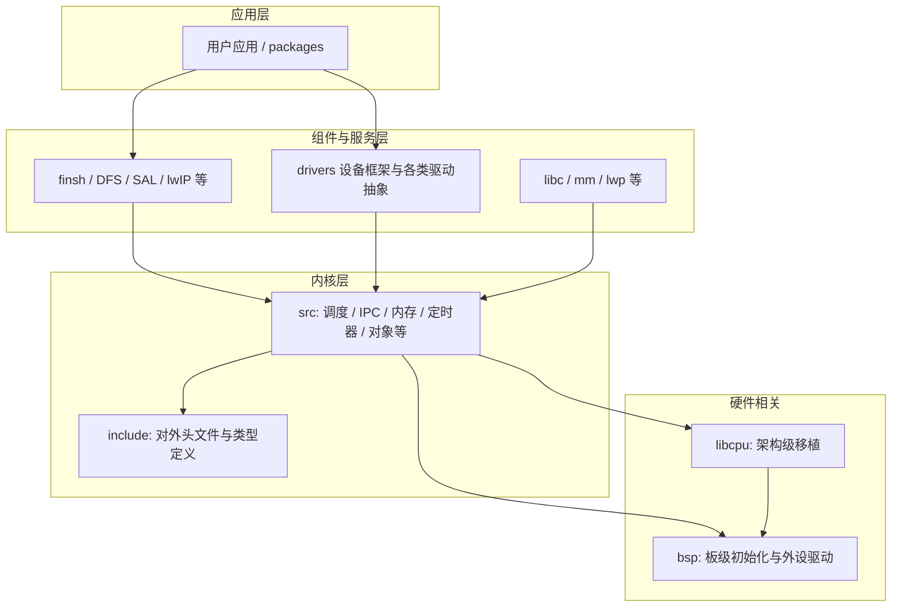

# RT-Thread 5.2.0 代码架构分析

本文档基于仓库内 `rt-thread-5.2.0` 源码树，从目录职责、内核与组件边界、构建与配置方式等角度说明整体架构，便于阅读与二次开发。

---

## 1. 总体分层

RT-Thread 采用**内核 + 可裁剪组件 + 板级支持包（BSP）+ CPU 移植（libcpu）**的经典嵌入式 OS 结构：内核提供调度与同步等最小能力；组件在内核之上提供文件系统、网络、设备模型等；BSP 与芯片厂商 HAL/SDK 绑定；libcpu 按 CPU 架构提供上下文切换、中断入口等与指令集相关的代码。



---

## 2. 源码根目录一览

| 目录/文件 | 说明 |
|-----------|------|
| `src/` | 内核实现（与 `include/` 对应），C 源码为主 |
| `include/` | 内核对外头文件（如 `rtthread.h`、`rtdef.h` 等） |
| `libcpu/` | 各 CPU 架构的移植代码（上下文、启动、trap 等） |
| `components/` | 内核之上的组件（驱动框架、FinSH、网络、DFS 等） |
| `bsp/` | 各开发板/芯片的 BSP，含 `board.c`、`rtconfig.*`、`SConstruct` 等 |
| `tools/` | SCons 构建脚本（如 `building.py`）、工程导出、辅助工具 |
| `documentation/` | 官方文档素材与专题说明（与本文档互补） |
| `examples/` | 示例与单元测试用例（如 `examples/utest`） |
| `Kconfig` | 根菜单，串联 `src`、`libcpu`、`components` 等子 Kconfig |

根目录 `Kconfig` 通过 `rsource` 引入子配置，形成 **menuconfig** 的配置树：

```1:4:rt-thread-5.2.0/Kconfig
rsource "src/Kconfig"
rsource "libcpu/Kconfig"
rsource "components/Kconfig"
rsource "examples/utest/testcases/Kconfig"
```

---

## 3. 内核层（`src/` + `include/`）

### 3.1 设计要点

- **对象模型**：线程、信号量、互斥量、事件、邮箱、消息队列、定时器等均作为内核对象管理，见 `object.c` 中 `rt_object_info_type` 等与 `rt_object_*` API。
- **调度**：单核路径为 `scheduler_up.c`、`cpu_up.c`；使能 `RT_USING_SMP` 时编译 `scheduler_mp.c`、`cpu_mp.c`（由 `src/SConscript` 按宏裁剪源文件）。
- **进程间通信**：`ipc.c` 实现信号量、互斥、事件、邮箱、消息队列等。
- **内存**：小块内存 `mem.c`、Slab `slab.c`、内存池 `mempool.c`、多堆 `memheap.c` 等按 Kconfig 选择参与编译。
- **时钟与定时器**：`clock.c`、`timer.c`；系统节拍与软件定时器逻辑在此。
- **中断与 idle**：`irq.c`、`idle.c`；与 `rthw.h` 声明的 `rt_hw_interrupt_disable/enable` 等由 libcpu/BSP 实现。
- **内核微型 C 库**：`src/klibc/` 与 `include/klibc/`，提供内核态字符串、格式化等能力，减少对外部 libc 的依赖。

### 3.2 主要源文件与职责（`src/` 根下 `.c` 文件）

| 文件 | 职责摘要 |
|------|-----------|
| `thread.c` | 线程创建、删除、挂起、恢复、优先级等 |
| `scheduler_*.c` | 就绪队列与调度策略（UP/SMP 分支） |
| `ipc.c` | 同步与通信原语 |
| `mem.c` / `slab.c` / `mempool.c` / `memheap.c` | 各类内存管理算法 |
| `timer.c` / `clock.c` | 系统 tick 与定时器 |
| `object.c` | 内核对象容器与命名查找 |
| `kservice.c` | 内核公共服务（如早期输出、断言等） |
| `irq.c` | 中断嵌套与通知等与内核衔接部分 |
| `idle.c` | 空闲线程与低功耗钩子衔接 |
| `signal.c` | 信号（可选） |
| `defunct.c` | 线程回收等 |
| `components.c` | 组件初始化衔接（与 `RT_USING_COMPONENTS_INIT` 等配合） |

**说明**：历史版本中设备对象实现可能在 `src/device.c`；在 5.2.0 树中，**设备注册与设备框架核心**位于 `components/drivers/core/device.c`（如 `rt_device_register`）。`src/SConscript` 仍保留对 `device.c` 的条件移除逻辑，属于与旧布局兼容或预留，以当前仓库实际文件为准。

### 3.3 头文件组织（`include/`）

对外 API 多通过 `rtthread.h` 聚合包含 `rtconfig.h`、`rtdef.h`、`rtservice.h`、`rtm.h`、`rtatomic.h`、`rtklibc.h` 等，应用与 BSP 通常只需 `#include <rtthread.h>`。硬件相关抽象在 `rthw.h`（由 libcpu 或 BSP 提供具体实现）。

---

## 4. CPU 移植层（`libcpu/`）

### 4.1 职责

- 提供 **上下文切换**、**中断入口/向量**、**CPU 级 tick 或延时** 等与具体 ISA 绑定的实现。
- `libcpu/SConscript` 根据 `rtconfig.ARCH` 选择子目录参与编译，例如仅编译当前 BSP 对应的架构目录。

### 4.2 本树中可见的架构目录（节选）

`aarch64`、`arm`、`risc-v`、`mips`、`c-sky`、`ppc`、`rx`、`ti-dsp`、`sim`（模拟器）、`ia32` 等；具体以 `libcpu/` 下目录为准。

**与 BSP 的关系**：同一架构下，libcpu 解决「这颗 CPU 怎么跑 RT-Thread」；BSP 解决「这块板子有哪些外设、时钟树、链接脚本」。

---

## 5. 组件层（`components/`）

`components/SConscript` 遍历子目录中有 `SConscript` 的模块并合并进工程；可通过 `remove_components` 在 `PrepareBuilding` 时排除指定组件。

### 5.1 `components/Kconfig` 中的顶层划分

非 Nano 版本下，典型包含：

- **FinSH**：命令行（依赖 `RT_USING_CONSOLE` 时引入其 Kconfig）。
- **DFS**：虚拟文件系统。
- **drivers**：统一设备模型与各子类驱动（serial、I2C、SPI、PIN 等）。
- **libc**：newlib/armlibc 等适配与 POSIX 子集。
- **net**：网络协议栈与 SAL 等。
- **mm**：与 MMU 相关能力（在 `ARCH_MM_MMU` 条件下）。
- **lwp**：轻量进程（与 `RT_USING_SMART` 等配合）。
- **fal**、**utilities**、**vbus**、**mprotect**、**legacy** 等扩展或兼容模块。

设备驱动**框架**在 `components/drivers/`（如 `core/device.c`）；具体芯片外设驱动多在 **BSP** 或 **厂商 libraries** 中，通过 SConscript 追加。

---

## 6. BSP（`bsp/`）

每个 BSP 通常包含：

- `rtconfig.h` / `.config`：由 menuconfig 生成或手工维护的功能宏。
- `rtconfig.py`（或同类）：工具链、CPU、编译选项。
- `SConstruct`：设置 `RTT_ROOT`，调用 `tools/building.py` 中的 `PrepareBuilding`，再链接本板 `applications`、`drivers`、厂商库等。
- `board.c` / `board.h`：时钟、引脚、外设初始化。
- `link.lds` 或分散加载文件：链接布局。

典型 `SConstruct` 会设置 `RTT_ROOT` 指向本仓库根，并 `from building import *`，最后 `PrepareBuilding(env, RTT_ROOT, has_libcpu=False)`；若 BSP 自带 libcpu 变体，可能将 `has_libcpu` 设为 `True` 并在 BSP 内自行包含移植代码。

构建系统在 `PrepareBuilding` 中大致顺序为（逻辑上）：**BSP 的 SConscript → 内核 `src` → `libcpu`（可选）→ `components`**，见 `tools/building.py` 中相关 `SConscript` 调用。

---

## 7. 构建与配置体系

| 环节 | 作用 |
|------|------|
| **Kconfig** | 描述功能选项与依赖，生成 `.config` |
| **menuconfig / env** | 交互式裁剪内核与组件 |
| **SCons + `tools/building.py`** | 根据 `rtconfig.h` 中的宏（`GetDepend`）决定编译哪些 `.c`、包含路径与链接选项 |
| **BSP `SConstruct`** | 集成内核、组件、板级与芯片库，产出 `rt-thread.axf/elf` 等 |

内核 `src/SConscript` 使用 `GetDepend('RT_USING_*')` 删除不需要的源文件，实现**同一套源码、多种裁剪体积**的构建方式。

---

## 8. 运行时依赖关系（简图）

1. **BSP 启动汇编/startup** → 初始化栈、BSS、调用 `rt_hw_board_init` 等。
2. **`rtthread_startup()`**（通常在 `components.c` 或 BSP 中串联）→ 初始化内核对象、定时器、调度器。
3. **可选组件初始化** → DFS、网络、驱动框架注册等。
4. **首个线程 / main 线程** → 进入用户 `main()` 或 `void main_thread(void *p)` 等应用入口。

具体符号名以所启用 BSP 与 `RT_USING_USER_MAIN` 配置为准。

---

## 9. 阅读代码的推荐顺序

1. `include/rtdef.h`、`include/rtthread.h`：数据类型与 API 全貌。
2. `src/object.c`、`src/thread.c`、`src/scheduler_up.c`：调度与对象模型。
3. `src/ipc.c`、`src/clock.c`、`src/timer.c`：通信与时间。
4. 所选架构下 `libcpu/<arch>/...` 与当前 BSP 的 `board.c`、`drv_*.c`：打通「从复位到第一个线程」的路径。
5. `components/drivers/core/`：设备打开、读写、注册流程。
6. 按需深入 `components/net`、`components/dfs` 等。

---

## 10. 与官方文档的关系

本仓库 `rt-thread-5.2.0/documentation/` 下已有内核、设备、文件系统等专题文档；**本文档侧重源码树拓扑与模块边界**，可与官方在线文档配合使用。

---

## 修订说明

- 分析对象路径：`RtThreadOsLearn/rt-thread-5.2.0/`（版本以目录名为准）。
- 若后续升级 RT-Thread 大版本，请以对应分支的 `Kconfig`、`SConscript` 为准核对差异。
