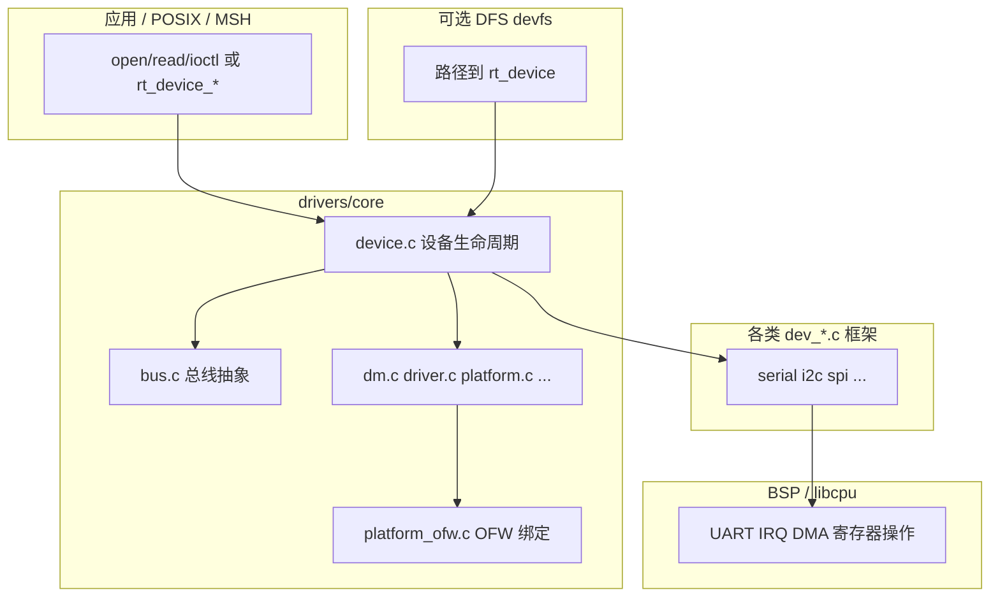

# RT-Thread 5.2.0 `components/drivers` 驱动模块详细分析

本文档基于 `rt-thread-5.2.0/components/drivers` 源码与 `Kconfig` / `SConscript`，说明**设备模型层次、各子模块职责、关键源码与典型配置**，便于与 BSP、`libcpu` 及 `net`/`dfs` 等组件对照阅读。

---

## 1. 在系统中的位置

- **上层**：应用、`libc` POSIX 设备 I/O、Finsh、`DFS` devfs 等通过 `rt_device_*` 或文件路径访问设备。  
- **本目录**：提供**统一设备对象**、可选 **Linux 风格 DM（设备树驱动模型）**、各类**总线/类设备框架**及通用逻辑；**寄存器级 HAL** 多在 BSP 或厂商 SDK。  
- **下层**：`RT_USING_DEVICE` 依赖内核对象与调度；`RT_USING_DM` 常与 `RT_USING_OFW`、`ARCH_MM_MMU` 等配合，在 Cortex-A / 部分 RISC-V 等平台上使用 FDT 描述硬件。

根 `drivers/Kconfig` 通过 `rsource` 引入各子目录 Kconfig，与 `components/drivers/SConscript` 递归编译各子目录共同构成「Device Drivers」菜单下的可选能力。

---

## 2. 设备模型：从 `device.c` 到 DM

### 2.1 经典设备层（`RT_USING_DEVICE`）

`core/device.c` 实现 RT-Thread 最早的**字符设备风格**模型：

- `rt_device_register` / `rt_device_unregister`：将 `struct rt_device` 挂入内核对象容器，初始化引用计数、可选 POSIX `fops` 与 `wait_queue`；在 DFS v2 + devfs 下会 `dfs_devfs_device_add`。  
- `rt_device_find`、`rt_device_open` / `close` / `read` / `write` / `control`：对驱动回调的分发；支持 **`RT_USING_DEVICE_OPS`** 时用 `dev->ops` 函数表，否则用内嵌函数指针字段。

该层与具体总线无关，任何外设只要填好 `rt_device` 与读写控制接口即可注册为设备。

### 2.2 设备总线（`RT_USING_DEV_BUS`）

`core/bus.c`：在开启 **`RT_USING_DEV_BUS`** 或 **`RT_USING_DM`** 时编译。提供总线上的设备发现、挂载等抽象（与 SMART 默认策略相关，见 `core/Kconfig`：`default y if RT_USING_SMART`）。

### 2.3 驱动模型 DM（`RT_USING_DM`）

开启 **`RT_USING_DM`** 后，`core` 额外编译：

| 文件 | 作用概要 |
|------|----------|
| `dm.c` | DM 公共逻辑：如 IDA 分配、SMP 下从核初始化导出段 `rt_dm_secondary_cpu_init` 等 |
| `driver.c` | 驱动注册、probe 等与 `struct rt_driver` 相关逻辑 |
| `platform.c` | 平台设备与驱动匹配 |
| `power_domain.c` | 电源域设备树节点解析与运行时管理 |
| `numa.c` | NUMA 相关（多节点内存场景） |
| `mnt.c` | 在 **`RT_USING_DFS`** 时参与挂载等协作 |

开启 **`RT_USING_OFW`** 时再增加 **`platform_ofw.c`**：把 FDT 中的节点与 platform driver 绑定。

**结论**：`DM + OFW` 路径接近 Linux 的「设备树 + platform driver」；未开 DM 的 MCU BSP 多数仍用「板级代码直接 `rt_device_register`」。

### 2.4 层次关系（示意）

---

## 2.5 源码主线（必读调用链）

如果你要“读懂 `components/drivers` 代码到底怎么跑起来”，建议先抓下面三条主线：

### A. 设备生命周期主线（`core/device.c`）

1. 驱动注册：`rt_device_register(dev, name, flags)`
   - 做名字去重
   - 调 `rt_object_init` 挂入内核对象系统
   - 初始化 `ref_count/open_flag`
2. 打开设备：`rt_device_open(dev, oflag)`
   - 若未激活先调用驱动 `init`
   - 首次 open 或 open 模式变化时调用驱动 `open`
   - 增加引用计数
3. 数据通路：`rt_device_read/write/control`
   - 统一分发到具体驱动 `ops->read/write/control`
4. 关闭设备：`rt_device_close`
   - `ref_count` 归零时才真正调用驱动 `close`
5. 可选回调：`rt_device_set_rx_indicate` / `rt_device_set_tx_complete`
   - 中断收发型驱动（串口、CAN、网卡）大量使用

这条主线是所有子系统的公共“骨架”。

### B. 构建开关主线（`core/SConscript` + `core/Kconfig`）

- 总是编译：`device.c`（前提 `RT_USING_DEVICE`）
- 仅在 `RT_USING_DEV_BUS` 或 `RT_USING_DM` 打开时编译：`bus.c`
- `RT_USING_DM` 打开时继续拉起：`dm.c`、`driver.c`、`platform.c`、`power_domain.c` 等
- `RT_USING_OFW` 打开时再加入：`platform_ofw.c`

也就是说：你看到的“drivers 代码体量”会随 Kconfig 成倍变化。

### C. 子系统落地主线（以 CAN 为例）

1. 框架层定义统一对象与 API（`components/drivers/can/dev_can.c`）
2. BSP 实现 `rt_can_ops`（如 `configure/sendmsg/recvmsg/control`）
3. BSP 中断回调转发到框架：`rt_hw_can_isr(can, event)`
4. 应用统一通过 `rt_device_open/read/write/control` 使用

串口、I2C、SPI、RTC、WDT 等子系统都遵循这个模式：  
**“框架定义语义，BSP填硬件细节”**。

---

## 3. 按子目录详解（与根 `drivers/Kconfig` 顺序对齐）

下列与 `components/drivers/Kconfig` 中 `rsource` 顺序一致，并补充**未在根 Kconfig 列出但存在 `SConscript` 的目录**。

### 3.1 `core/` — 设备核心

已述。编译入口：`core/SConscript` 根据 `RT_USING_DEV_BUS`、`RT_USING_DM`、`RT_USING_OFW`、`RT_USING_DFS` 组合选择源文件。

---

### 3.2 `ipc/` — 硬件 IPC 驱动框架

用于 SoC 内**硬件 IPC 通道**（非内核 `rt_ipc` 软件对象）的驱动侧抽象，便于多核或异构核之间通过硬件 mailbox/IPC 硬件传输控制块或数据。具体硬件在 BSP 实现并注册。

---

### 3.3 `serial/` — 串口

- **`RT_USING_SERIAL`**：框架源码。  
- **`RT_USING_SERIAL_V2`**：`dev_serial_v2.c`；否则 `dev_serial.c`。  
- **`RT_USING_SERIAL_BYPASS`**：`bypass.c`（旁路/直通类场景）。  
- **`RT_USING_SMART`**：增加 `serial_tty` 与终端类结合。  
- **`RT_USING_DM`**：`serial_dm.c` 设备树绑定串口。

BSP 提供 UART 中断与 DMA 填充 ringbuffer，框架负责 `rt_device` 语义与可选 V2 环形缓冲策略。

---

### 3.4 `can/` — CAN 总线

SocketCAN 风格或 RT 自定义 CAN 设备接口（以 `rtdevice.h` 中 CAN 段为准），BSP 实现 `send`/`recv` 与波特率、过滤器配置。

---

### 3.5 `cputime/` — CPU 周期计时

提供 **`struct rt_clock_cputime_ops`**：分辨率与当前计数值，用于**高精度时间戳、性能统计**。例如 `cputime_cortexm.c` 使用 **DWT CYCCNT**（或 `PKG_USING_PERF_COUNTER` 的 tick），与 OS tick 独立。

**注意**：与 `ktime` 的「内核时间子系统」互补：cputime 偏「CPU 周期级读数」，ktime 偏「boot 时间、hrtimer、与 tick 关系」。

---

### 3.6 `i2c/`、`spi/` — I2C / SPI 总线

- 总线设备：`rt_i2c_bus_device` / `rt_spi_bus_device` 等。  
- 上层通过 **总线传输 API** + **挂在总线上的从设备**（传感器、Flash、屏幕等）协作。  
- SPI 下常见 **`spi/sfud`**（见 SFUD 包或 `drivers/spi` 内 README）：通用 SPI Nor Flash 驱动，与 **`fal`** 组件可配合。

---

### 3.7 `phy/`、`phye/` — 以太网 PHY

**`phy`**：MDIO 可读写的以太网 PHY 设备抽象（链路、自协商）。  
**`phye`**：PHY 扩展或片内 Ethernet 子系统与外部 PHY 之间的扩展层（依 SoC 而定）。与 `components/net` 及 MAC 驱动共同完成网络栈最底层。

---

### 3.8 `misc/` — 杂项

无法归入标准总线的小设备或过渡实现（依版本与 BSP 而定），阅读时以具体 `.c` 与 Kconfig 为准。

---

### 3.9 `mtd/` — MTD 存储

**Memory Technology Device**：NOR/NAND 等原始 Flash 的擦除/读写块抽象，为 **UBI/JFFS2** 类或 **`fal`** 提供更贴近硬件的一层；具体芯片驱动在 BSP 或 packages。

---

### 3.10 `pm/` — 电源管理

`pm.c` 等实现 **PM 2.0** 框架：多睡眠等级、tickless 阈值、设备 `RT_PM_DEVICE_CTRL` 挂钩、进入/退出休眠时通知已注册设备。BSP 需提供底层 WFI/时钟门控与唤醒源配置。

---

### 3.11 `rtc/` — 实时时钟

RTC 设备读写、闹钟、可选 NTP/应用层校时逻辑与驱动分离；硬件在 BSP。

---

### 3.12 `sdio/` — SDIO / SD / MMC

主机控制器抽象，块读写经 **`block`** 或文件系统栈向上呈现；与 `RT_USING_SDIO` 等宏配合。

---

### 3.13 `spi/` — 见 3.6

---

### 3.14 `watchdog/` — 看门狗

喂狗、`set_timeout` 等统一接口；超时触发复位或中断由硬件决定。

---

### 3.15 `audio/` — 音频

含 **`dev_audio_pipe.c/.h`** 等：音频管道、声卡与 codec 之间的数据路径抽象，多为 **I2S + codec** 场景；具体 DMA 与寄存器在 BSP。

---

### 3.16 `sensor/` — 传感器框架

- **`RT_USING_SENSOR_V2`**：`v2/sensor.c`（及可选 `sensor_cmd.c` MSH 命令）。  
- 否则 **`v1`** 实现。  

统一 **数据类型、量程、上报接口**，便于上层以设备名 + `control` 读取多类传感器。

---

### 3.17 `touch/` — 触摸屏

触摸输入设备抽象（坐标、多点），常与 GUI 包配合。

---

### 3.18 `graphic/` — 显示

当前树中该目录**仅有 `Kconfig`**，无通用 `SConscript` 源文件集；实际显示驱动多在 **BSP** 或 **LVGL/显示软件包** 中，此处多为配置入口占位。

---

### 3.19 `hwcrypto/` — 硬件加解密

对称/非对称/哈希等引擎的 `rt_hwcrypto_*` 风格封装，BSP 对接 SoC 安全模块。

---

### 3.20 `wlan/` — Wi-Fi 设备抽象

`dev_wlan.c` 为核心；按选项增加：

- 管理：`dev_wlan_mgnt.c`  
- MSH：`dev_wlan_cmd.c`  
- 协议/与 lwIP 衔接：`dev_wlan_prot.c`、`dev_wlan_lwip.c`  
- 配置与工作队列：`dev_wlan_cfg.c`、`dev_wlan_workqueue.c`  

依赖 **`RT_USING_WIFI`**，与 **`sal` + lwIP** 及具体 WiFi 驱动（BSP/厂商）组合使用。

---

### 3.21 `led/` — LED

简单 LED 设备（GPIO 或 PWM 灯效），便于以设备名统一控制。

---

### 3.22 `mailbox/` — 核间邮箱

多核 SoC 上硬件 mailbox 驱动框架，用于核间短消息或门铃，与 `ipc` 软件语义不同。

---

### 3.23 `ata/`、`nvme/`、`scsi/` — 磁盘类协议

- **ATA**：传统 PATA/SATA 主机侧抽象。  
- **NVMe**：PCIe NVMe 控制器与命名空间块设备路径。  
- **SCSI**：包括 USB Mass Storage 等 SCSI 命令路径的块层支撑。

均与 **`block`** 子系统衔接，向 DFS 或分区代码提供扇区访问。

---

### 3.24 `block/` — 块设备子系统

依赖 **`RT_USING_BLK`**。典型源文件：

| 文件 | 作用 |
|------|------|
| `blk.c` | 块设备 `rt_device` 的 open/read/write，转调 `rt_blk_disk` 的 `ops->read/write` |
| `blk_dev.c` | 分区设备节点、磁盘与分区链表管理 |
| `blk_dfs.c` | 与 DFS 挂载、路径协作 |
| `blk_partition.c` | MBR/GPT 等分区表解析（与 `partitions/` 子目录扩展配合） |

**数据路径**：底层磁盘驱动注册 `rt_blk_disk` → 框架创建分区 `rt_blk_device` → 文件系统或 `dd`/MSH 命令访问。

---

### 3.25 `regulator/`、`reset/`、`thermal/`

- **regulator**：电压/电流调节器 enable/set_voltage，供 WiFi、SDIO、音频等外设上电时序使用。  
- **reset**：硬件复位线控制（整片外设或子系统 reset）。  
- **thermal**：温度传感器读数与过热策略钩子（与 `pm` 可联动）。

---

### 3.26 `virtio/` — VirtIO

半虚拟化 guest 驱动前端，与 hypervisor 提供的 virtio 设备通信（块、网、串口等），用于 **qemu / 虚拟化** 等场景。

---

### 3.27 `dma/` — DMA 控制器与缓冲池

依赖 **`RT_USING_DMA`**。

- **`dma.c`**：`rt_dma_controller_register`、通道申请/释放、传输描述符提交等与 **`struct rt_dma_controller`** 相关的**现代 DM 风格** DMA 引擎管理；与 `ofw_node` 绑定 `rt_dm_dev_bind_fwdata`。  
- **`dma_pool.c`**：**DMA 一致性/非一致性缓冲区**、与 IOMMU/MM 协作的 `dma_alloc`/`dma_free`、`dma_map_*` 缓存同步（`rt_hw_cpu_dcache_ops`）、来自设备树的 **dma-ranges** 等区域管理。

适合 **Cortex-A + 外设 DMA** 场景；简单 MCU 也可能仅用 BSP 层直接操作 DMA 而不走该框架。

---

### 3.28 `mfd/` — Multi-Function Device

一个物理芯片内多个子设备（如 PMIC 里 RTC + regulator）共享寄存器与中断时的 MFD 父设备描述，子设备再挂 `regulator`、`rtc` 等驱动。

---

### 3.29 `ofw/` — Open Firmware / FDT

解析 **flattened device tree**，提供 `ofw` API、中断域、`libfdt` 等；与 **`RT_USING_OFW`**、`core/platform_ofw.c` 一起完成「设备树 → `rt_platform_device` → driver probe」链路。

---

### 3.30 `pci/` — PCI/PCIe

含 **host**（根复杂、驱动如 `host/dw` DesignWare）、**endpoint**（EP 模式）、**MSI** 等子菜单。用于 **PCIe NVMe、PCIe 网卡、PCIe WiFi** 等。

---

### 3.31 `pic/` — Programmable Interrupt Controller

中断控制器抽象（含多路 IRQ domain、级联），BSP 或架构代码向内核 `rt_hw_interrupt_*` 注册前，可先经 PIC 层描述硬件 IRQ 号到 Linux 风格 irq 的映射。

---

### 3.32 `pin/`、`pinctrl/`

- **pin**：GPIO **`rt_pin_mode` / `rt_pin_write` / `rt_pin_read`** 等设备接口。  
- **pinctrl**：复用器（mux）与电气属性（pull、drive strength）由控制器统一配置，避免与 GPIO 层冲突。

---

### 3.33 `ktime/` — 内核时间子系统

详见目录内 **`README.md`**。要点：

- **boottime**：上电至当前的单调时间（部分平台 weak，需 BSP 适配）。  
- **cputimer**：与 OS tick 同源或相关的计数器统一查询接口。  
- **hrtimer**：纳秒级高精度定时器（默认可退化为软件定时器，精度受 tick 限制）；提供 `rt_ktime_hrtimer_ndelay` 等与线程睡眠结合的非忙等延时。

---

### 3.34 `clk/` — 时钟子系统

`clk.c` 等实现 **时钟节点树**、引用计数、rate 计算、**notifier**（频率变更通知）。驱动在 `probe` 中 `clk_get` / `clk_enable` / `clk_set_rate`，与 **CCF（Common Clock Framework）** 思路相近，规模较大（千行级），是 DM 平台上外设正常工作的关键基础设施。

---

### 3.35 `hwtimer/` — 硬件定时器设备

将片上 **通用定时器** 抽象为 `RT_Device_Class_Timer` 设备：周期/单次、超时计算、溢出处理等。  
在 **`RT_USING_DM`** 下提供 **`rt_hw_us_delay`** 的弱实现挂钩：若未接 BSP 的硬件微秒延时，会触发 assert，提示在 **libcpu** 或 BSP 实现。

---

### 3.36 `usb/` — USB

- 传统 **USB Host/Device** 栈入口与子目录（依 Kconfig）。  
- **`usb/cherryusb/`**：现代 **CherryUSB** 栈（多类、多 HCD），自带多平台 port README。

---

## 4. 未出现在根 `Kconfig` 但存在的目录

### 4.1 `smp_call/`

**依赖 `RT_USING_SMP`**。`smp_call.c` 实现跨核函数调用：**IPI + 每核请求队列**，`rt_smp_call_each_cpu` / `rt_smp_call_cpu_mask` 等在指定 CPU 上执行回调，用于 TLB shootdown、缓存维护、驱动多核同步等。

### 4.2 `iio/`

**依赖 `RT_USING_DM`**。`iio.c` 提供 **Industrial I/O** 风格 ADC 等设备框架（与 Linux IIO 概念类似），与 `sensor` 框架侧重点不同：IIO 更偏 **原始采样通道、buffer、trigger**。

---

## 5. 与 `drivers/include` 的关系

对外类型与宏集中在 **`components/drivers/include`**（工程里常通过 `rtdevice.h` 等聚合包含）。阅读某一子系统时建议：**子目录 `.c` + `include/drivers/xxx.h`** 对照，避免遗漏 `ioctl` 命令码与结构体定义。

---

## 6. 学习路径建议

1. **MCU 无设备树 BSP**：`core/device.c` → 任选 `serial/dev_serial.c` → BSP 中 `uart` 注册流程。  
2. **Linux 风格 SoC**：`RT_USING_DM` + `ofw` + `platform.c` + `clk` + `dma` + `pin/pinctrl`。  
3. **存储**：`block/blk*.c` + BSP 存储驱动 + `dfs`/`fal`。  
4. **网络**：`phy` + BSP MAC + `components/net`。  
5. **低功耗**：`pm/pm.c` + BSP 唤醒源。

---

## 7. 相关文档

- 仓库内组件总览：`doc/RT-Thread-5.2.0-components-模块详解.md`  
- `ktime` 细节：`components/drivers/ktime/README.md`  
- CherryUSB：`components/drivers/usb/cherryusb/README.md` / `README_zh.md`

---

*文档对应源码树：`rt-thread-5.2.0/components/drivers`（5.2.0）。*
